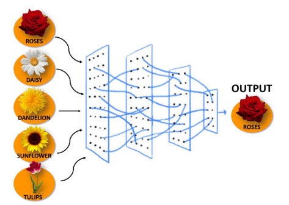
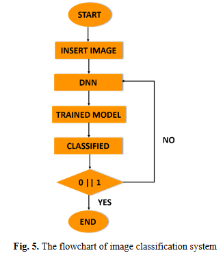

# A study on Image Classification based on Deep Learning and Tensorflow

[Article Link](https://www.researchgate.net/publication/332850035_A_study_on_Image_Classification_based_on_Deep_Learning_and_Tensorflow)

## Abstract

This article talks about implementing image classification by using te Deep Neural Network. The implementation is done using framework Tensorflow. There 5 types of flower that have been used on this article's research. The results show that the models have high accuracy around 90 percent.

## Method

There are four (4) phases throughout this process and each of the phases will be discussed. Each of the phases are included on TensorFlow as the open source software and Python as its programming language. Then, the process is continued to collect some of the images (inputs), by applying DNN and lastly all images will be classified into their groups.

### Training Images

The data used by this paper mainly comes from ImageNet. There are thousands of flower images and it split into 5 categories. The total images is 3670 which include Daisy, Dandelion, Rose, Sunflower, and Tulip.

### Implementaion of Deep Learning

The input consist of 5 categories and undergoes training with some hidden layers. The input are also fixed size of 224x224 pixels RGB image

### Mobile Net Perfomance

in this paper, MobileNet is used as the ‘trainer’ as it consists ofsmall efficient of deep neural networks (DNN). It has two (2) ways to configure this MobileNet which is the first one is input image resolution and the size of the model within MobileNet. As for this research, it was set as shown in Figure 4 where Input Image Resolution is set as 224 and Size of the model is set as 0.50.

### Flow of the Process

## Results and Conclusion

The roles of epochs in DNN was able to control accuracy and also prevent any problems such as overfitting. Implementation of deep learning by using framework TensorFlow also gave good results as it is able tosimulate, train and classified with up to 90% percent of accuracy towards five (5) different types of flowers that have become a trained model. Lastly, Python have been used as the programming language throughout this research since it comes together with framework TensorFlow which leads to designing of the system involved Python from start until ends
